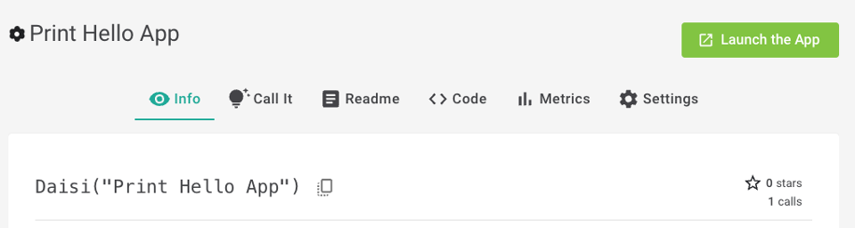
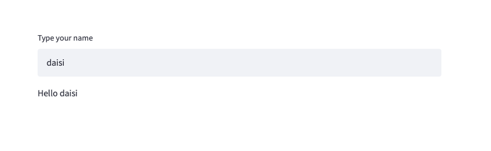

Give a UI to your daisi with Streamlit
========================================================

Showcase the capabilities of your daisi by giving it a front end with `Streamlit <https://docs.streamlit.io>`_

When you import ``streamlit`` in the code of your daisi, the
button **Launch the app** will be active in the daisi page on `app.daisi.io <app.daisi.io>`_

A streamlit app which works in your local environment will work similarily when deployed on the **daisi** platform.  
A good practice is to write the Streamlit commands inside a dedicated function.

Example :  

.. code-block:: python

  import streamlit as st

  def hello(name="World"):
    return "Hello " + str(name)
  
  def st_ui():
    name = st.text_input('Type your name')
    greeting = hello(name)
    st.write(greeting)
  
  if __name__ == "__main__":
    st_ui()

Turn this code into a daisi named "Print Hello App" by linking its Github repo in the daisi platform.   

You have now an endpoint for the ``hello`` function as well as a ``streamlit`` app with a shareable URL.   
Check it out here : `"Print Hello App" <https://app.daisi.io/daisies/46c4198a-9def-43c4-af9a-38d4659be737/how-to-use>`_ !   

**UI rendering (click on the Launch the App button) :**   

   
   
It will redirect you to a new browser tab displaying the app:   

**Calling the endpoint with pydaisi :**   

>>> import pydaisi as pyd
>>> printhello = pyd.Daisi("Print Hello App")
>>> print(printhello.hello().value)
Hello World

